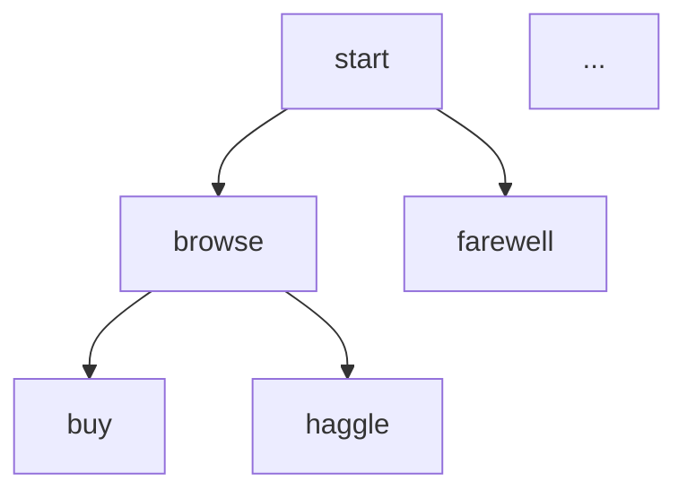

# Exporting Graphs

The `quest export` subcommand compiles an Urd script and exports its internal representation (IR) graph in a visual format. This is invaluable for understanding dialogue flow, debugging complex branching, and producing documentation.

## Usage

```bash
quest export <script> [--format <fmt>] [--output <file>]
```

## Export Formats

The `--format` (or `-f`) flag selects the output format. There are two formats available: `dot` and `mermaid`. The default is `mermaid`.

### Graphviz DOT

```bash
quest export story.urd --format dot
```

Produces a [Graphviz](https://graphviz.org/) DOT graph. Render it to an image with:

```bash
quest export story.urd -f dot -o story.dot
dot -Tpng story.dot -o story.png
```

DOT output is the most detailed — every IR node, edge, and label is represented. It works best for deep debugging of the compiled graph.

### Mermaid Flowchart

```bash
quest export story.urd --format mermaid
```

Produces a [Mermaid](https://mermaid.js.org/) flowchart that you can paste directly into GitHub Markdown, documentation sites, or the [Mermaid Live Editor](https://mermaid.live/).

````markdown

````

This is the default format and the most convenient for documentation.

## Writing to a File

By default, `quest export` writes to **stdout**. Use `--output` (or `-o`) to write to a file instead:

```bash
quest export story.urd --format dot --output story.dot
quest export story.urd --format mermaid -o story.md
```

## Typical Workflows

### Quick visual check

Pipe Mermaid output directly into a preview tool or paste it into a Markdown file:

```bash
quest export story.urd
```

### Generate a PNG diagram

```bash
quest export story.urd -f dot -o graph.dot
dot -Tpng graph.dot -o graph.png
```

Or, if you have the Mermaid CLI (`mmdc`) installed:

```bash
quest export story.urd -f mermaid -o graph.mmd
mmdc -i graph.mmd -o graph.png
```

### Embed in project documentation

```bash
quest export story.urd -f mermaid -o docs/dialogue-flow.md
```

Then include the file in your mdbook, wiki, or README.

## Notes

- The export operates on the **compiled IR graph**, not the raw source. This means you see the actual structure the VM would execute, including resolved jumps and flattened control flow.
- Both formats represent the same underlying graph — they differ only in presentation.
- If the script has parse or compilation errors, `quest export` will report them to stderr and exit with a non-zero status code.